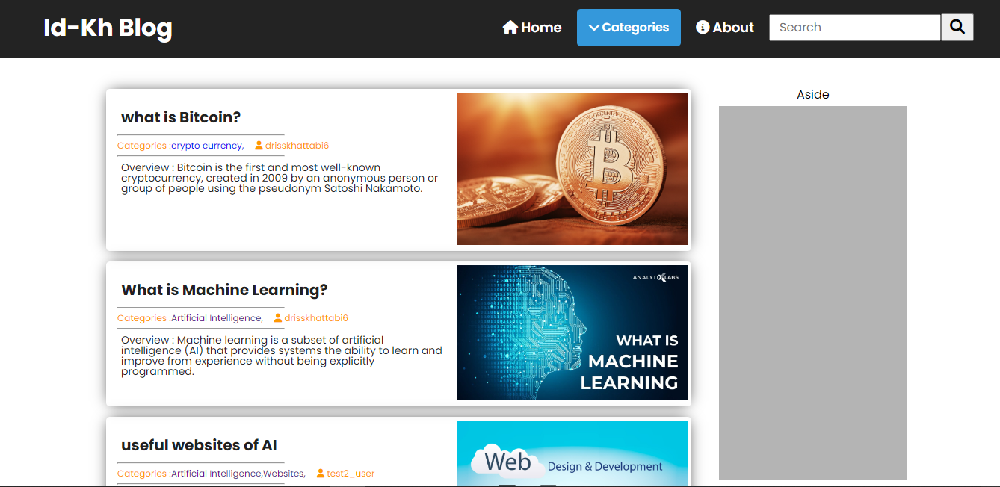

# Django Blog Project :

This repository contains a **Personel Blog** Project developed using the Django Framework.

Only the **Super User** can create, edite, and delete posts, authors and category in **admin Panel** of django project.

this is a example image of the main page of the blog : 


The User can search for a specific topic in the blog, and he can surf a specific category of topics.

# Run Project : 

To download the project :

```
git clone https://github.com/drisskhattabi6/Django-Blog-Project.git
```

Once the project is downloaded, navigate into the project directory:

```
cd Django-Blog-Project
```

Before running the project, make sure you have Python and Django installed on your system. You can install Django using pip:

```
pip install -r requirements.txt
```

Next, you'll need to apply migrations to set up the database schema:

```
python manage.py migrate
```

After the migrations are applied successfully, you can start the development server:

```
python manage.py runserver
```

The development server will start, and you can access the Blog Project by navigating to `http://127.0.0.1:8000/` in your web browser.

------

Feel free to explore the project and customize it according to your requirements. If you encounter any issues or have any questions, don't hesitate to reach out!"
